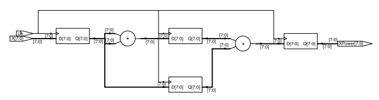
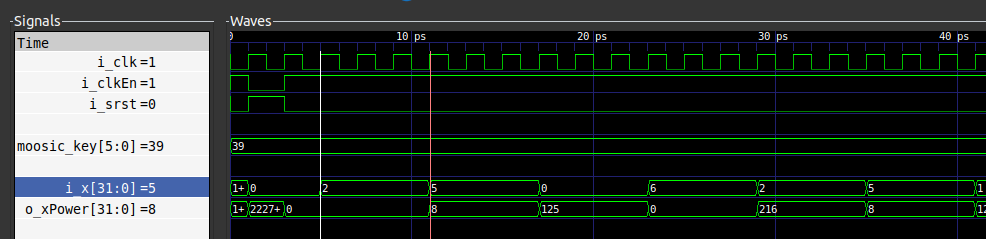
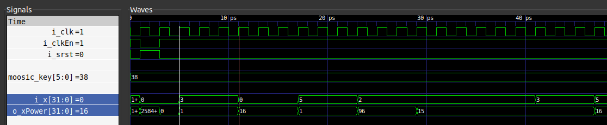

# logicLocking

The aim of this project is to try out the logic locking Yosys plugin.

Yosys has an excellent blog post that explains the concept of logic locking and
demonstrates it with an example: https://blog.yosyshq.com/p/logic-locking-with-moosic/.

The Moosic-Yosys-Plugin repository outlines the installation instructions of the
plugin: https://github.com/Coloquinte/moosic-yosys-plugin.

## Without

The `rtl` sub-repository contains a simple module that calculates the cube of an
input. The module `power3.sv` can be found in the rtl takes an input `i_x` and calculates its cube in 3 clock cycles. Its schematic is shown below:

A simple C++ tb can be found in the `tb` sub-repository. The tb drives the input and after 3 clock cycles verifies the output against an expected value.

To create the tb, run a simulation and generate waveforms displaying the
signals: `cd tb && make all`.

## With

The power3 module was synthesized using Yosys and logic-locking was applied on
its netlist (following similar instructions in the blog post). The generated
module with logic-locking port and logic insertions can be found in the `rtl`
sub-repository.

The same Tb was copied over from the without sub-repository and the port `moosic_key` port was driven with the key (`0x39`) at the start of the
simulation. The waveforms below demonstrate that the `power3` module behaves as
intended and all the tests pass.

When the key is changed to an incorrect value all the tests fail as shown below:

